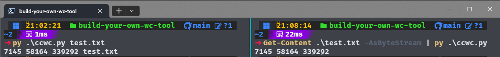

# Build Your Own WC Tool

## About the Project

---

A minimal recreation of the Unix command line tool WC. This was a challenge from the website [Coding Challenges](https://codingchallenges.fyi/).
Link to the challenge: [Build Your Own WC Tool](https://codingchallenges.fyi/challenges/challenge-wc)

## Overview

---

The wc (word count) tool in Unix-like operating systems is a command-line utility used to count the number of lines, words, and bytes (or characters) in files.

## Built With

---

Python 3.13.2
